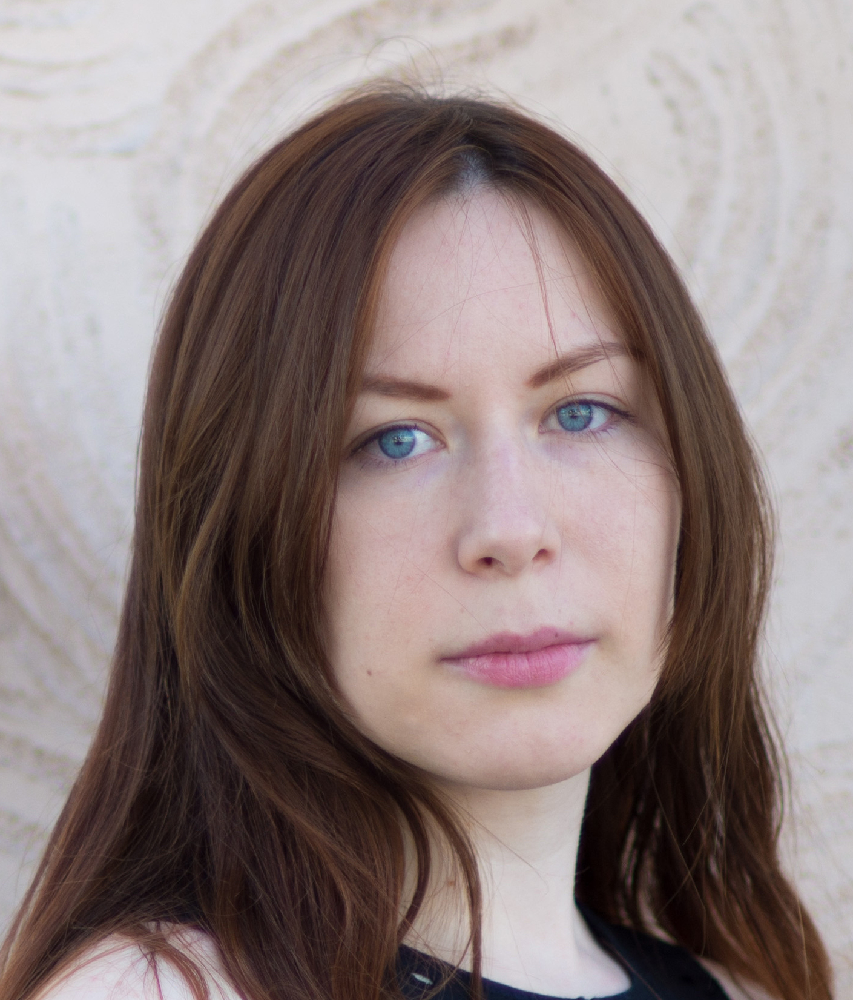

## Hello guest! 

You reached a personal page of Olga Ivanova (me), born in Russia and currently living in Heidelberg, Germany. I got my bachelor degree in computer science in Russia but after several years of working as a java developer I decided to change my carrier path quite drastically and left Russia pursuing a new path - Bioinformatics. I finished my master in bioinformatics and systems biology in Amsterdam at Vrije Universiteit. For pure CS layman it was not an easy path but I did everything in my power to make it work. I fall in love with Amsterdam and the Netherlands; I spent 6 long nice years eating poffertjes and herrings, hunting for sun during all seasons, fighting with wind and appreciating nice people and cosy places. This all resulted for me in Dutch nationality, and all freedom and values related to it.

Bioinformatics became a big part of my life, my profession and my passion. I worked as a bioinformatician/systems biologist at Academisch Medisch Centrum in Amsterdam and as a junior teacher at Vrije Universiteit (part-time) for 1.5 years. Then I moved to Germany to [saez lab](http://saezlab.org/) to get a PhD.

The topics I find exciting are AI/ML for bioinformatics data, new tech such as genome editing (CRISPR/CAS9) and single-cell, ageing. My current research projects touch upon biological networks and tools for them, dynamic modeling of biological networks with logical models, omics integration.  

If you work in science, it is your only hobby because there is rarely any time for other hobbies. But in the spare moments I do love reading, swimming and diving, playing tennis, travelling and hiking, listening to music, among other things. I wish I have more time for my hobbies and I find it difficult to cope with the idea that we have just one life and only 24 hours per day. 

### Publications
Epistasis project, 2017-2018: 
[The ability of transcription factors to differentially regulate gene expression is a crucial component of the mechanism underlying inversion, a frequently observed genetic interaction pattern](https://journals.plos.org/ploscompbiol/article?id=10.1371/journal.pcbi.1007061)

Asthma-related work, 2018-2019: [What did we learn from multiple omics studies in asthma?](https://www.ncbi.nlm.nih.gov/pubmed/31004501)

### Papers submitted
Epistasis project, 2017-2018: A framework for exhaustive modelling of genetic interaction patterns using Petri nets

### Presented on the conferences
Talk at BioSB2018: "A framework for exhaustive simulation of epistatic patterns using Petri net models"  
Poster at ECCB2018: "Towards generating AsthmaMap Activity Flow"

### Organizing
Amsterdam, 2018 [SbS@UvA Friday club](http://ias.uva.nl/research/simulation-based-science/simulation-based-science.html) (modelling community for UvA scientists)  
Amsterdam, 2018-2019 [R-Ladies Amsterdam](https://www.meetup.com/rladies-amsterdam/)

### Participating in 
[Asthma map](http://asthma-map.org/)

### Contacts
olga.ivanova at bioquant.uni-heidelberg.de  
[Linkedin](https://www.linkedin.com/in/olga-ivanova-b984492a/)
